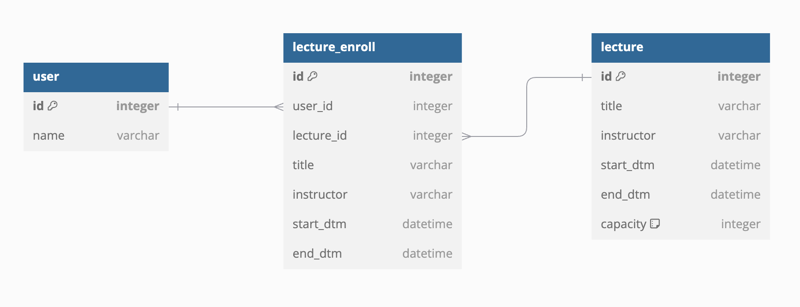

## 특강 신청 서비스 ERD

### user 테이블
- id: 사용자 고유 식별자 (기본키)
- name: 사용자 이름 
 
### lecture 테이블
- id: 강의 고유 식별자 (기본키)
- title: 강의 제목
- instructor: 강사 이름
- start_dtm: 강의 시작 일시
- end_dtm: 강의 종료 일시
- capacity: 강의 수용 인원

### lecture_enroll 테이블
- id: 수강 신청 고유 식별자 (기본키)
- user_id: 수강하는 사용자 식별자 (외래키로 user 테이블의 id를 참조)
- lecture_id: 수강하는 강의 식별자 (외래키로 lecture 테이블의 id를 참조)
- title: 수강 신청한 강의 제목
- instructor: 수강 신청한 강의 강사 이름
- start_dtm: 수강 신청한 강의 시작 일시
- end_dtm: 수강 신청한 강의 종료 일시

### 관계 설명
user와 lecture_enroll: 사용자(user)는 여러 개의 강의(lecture)에 수강 신청할 수 있으므로 일대다 관계입니다.
lecture와 lecture_enroll: 강의(lecture)는 여러 사용자가 수강할 수 있으므로 역시 일대다 관계입니다.

---
## 참고
### **`이것부터 시작하세요!`**
- 아키텍처 준수를 위한 애플리케이션 패키지 설계
- 특강 도메인 테이블 설계 (ERD) 및 목록/신청 등 기본 기능 구현
- 각 기능에 대한 **단위 테스트** 작성

### **`STEP 3`**
- 설계한 테이블에 대한 **ERD** 및 이유를 설명하는 **README** 작성
- 선착순 30명 이후의 신청자의 경우 실패하도록 개선
- 동시에 동일한 특강에 대해 40명이 신청했을 때, 30명만 성공하는 것을 검증하는 **통합 테스트** 작성

### **`STEP 4`**
- 같은 사용자가 동일한 특강에 대해 신청 성공하지 못하도록 개선
- 동일한 유저 정보로 같은 특강을 5번 신청했을 때, 1번만 성공하는 것을 검증하는 **통합 테스트** 작성